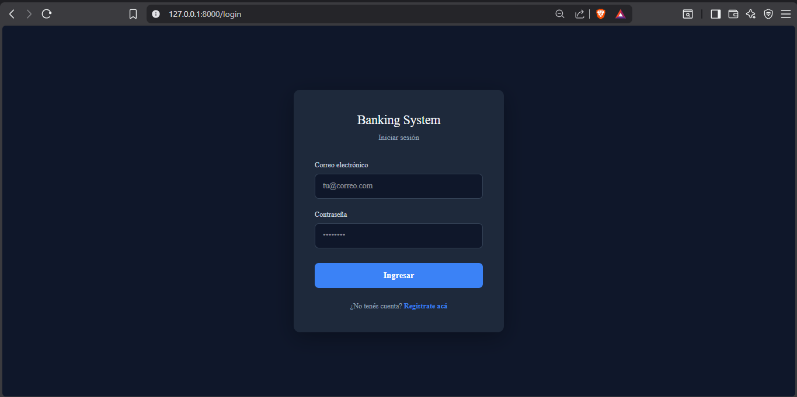
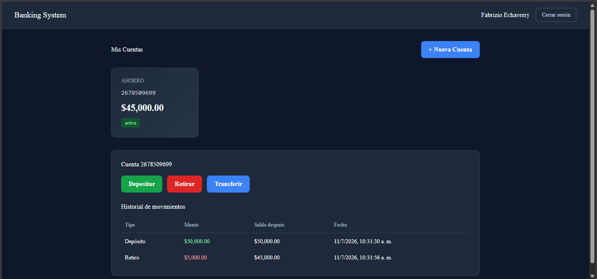
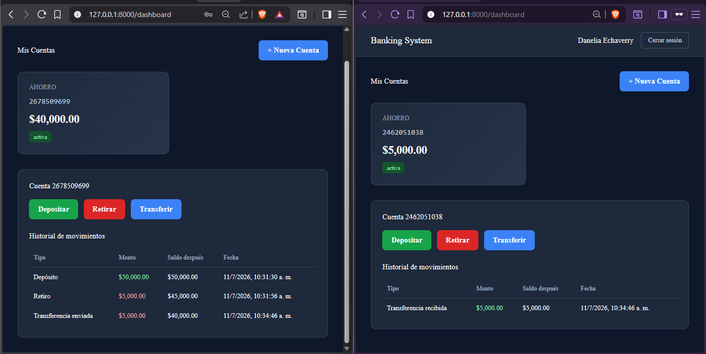

# Banking System

Sistema bancario full-stack que simula la gestión de cuentas, transacciones y transferencias entre usuarios, construido con Laravel y Vue.js.

## Descripción

Este proyecto implementa el flujo completo de un sistema bancario básico: registro y autenticación de usuarios, apertura de cuentas de distintos tipos, depósitos, retiros y transferencias entre cuentas, con un historial de movimientos auditable.

El objetivo del proyecto es demostrar el manejo de conceptos críticos en sistemas financieros: integridad transaccional, autenticación segura vía API, control de acceso a nivel de recurso y diseño de una arquitectura backend/frontend desacoplada.

## Capturas de pantalla

### Inicio de sesión


### Dashboard de cuentas


### Historial de transacciones


## Funcionalidades

- **Autenticación** basada en tokens con Laravel Sanctum (registro, login, logout)
- **Gestión de cuentas**: apertura de cuentas de tipo ahorro, corriente y crédito, con número de cuenta único generado automáticamente
- **Operaciones bancarias**:
  - Depósitos
  - Retiros con validación de saldo disponible
  - Transferencias entre cuentas (propias o de terceros) mediante número de cuenta
- **Auditoría de movimientos**: cada transacción registra el saldo resultante (`balance_after`) para trazabilidad completa
- **Integridad transaccional**: las operaciones críticas usan transacciones de base de datos (`DB::transaction`), garantizando que una transferencia no pueda descontar dinero de una cuenta sin acreditarlo en la otra
- **Control de acceso**: cada usuario solo puede ver y operar sobre sus propias cuentas
- **Roles de usuario**: cliente, cajero y administrador (base para expansión de permisos)
- **Frontend reactivo** en Vue.js 3 con manejo de estado centralizado (Pinia) y rutas protegidas

## Stack tecnológico

**Backend**
- PHP 8.2 / Laravel 12
- MySQL
- Laravel Sanctum (autenticación API)

**Frontend**
- Vue.js 3 (Composition API)
- Vue Router
- Pinia (manejo de estado)
- Axios
- Vite

## Arquitectura

El sistema sigue una arquitectura desacoplada: Laravel expone una API REST y Vue.js consume esa API como cliente, comunicándose mediante tokens Bearer.

```
Cliente (Vue.js) → API REST (Laravel + Sanctum) → MySQL
```

### Modelo de datos

- **users**: usuarios del sistema con rol asignado (cliente, cajero, admin)
- **accounts**: cuentas bancarias vinculadas a un usuario, con tipo, saldo y estado
- **transactions**: movimientos de cada cuenta, con tipo, monto, saldo resultante y referencia a la cuenta relacionada en caso de transferencias

## Endpoints principales

| Método | Ruta                          | Descripción                        | Autenticación |
|--------|-------------------------------|-------------------------------------|----------------|
| POST   | `/api/register`               | Registro de usuario                | No             |
| POST   | `/api/login`                  | Inicio de sesión                   | No             |
| POST   | `/api/logout`                 | Cierre de sesión                   | Sí             |
| GET    | `/api/accounts`                | Listar cuentas del usuario         | Sí             |
| POST   | `/api/accounts`                | Crear una nueva cuenta             | Sí             |
| GET    | `/api/accounts/{account}`      | Ver detalle y movimientos          | Sí             |
| POST   | `/api/accounts/{account}/deposit`  | Realizar un depósito           | Sí             |
| POST   | `/api/accounts/{account}/withdraw` | Realizar un retiro             | Sí             |
| POST   | `/api/accounts/{account}/transfer` | Transferir a otra cuenta       | Sí             |

## Instalación

### Requisitos previos

- PHP >= 8.2
- Composer
- Node.js y npm
- MySQL

### Pasos

1. Clonar el repositorio
```bash
git clone https://github.com/echaverrychristopher/banking-system-laravel.git
cd banking-system-laravel
```

2. Instalar dependencias de PHP
```bash
composer install
```

3. Configurar variables de entorno
```bash
cp .env.example .env
php artisan key:generate
```
Editar `.env` con los datos de tu conexión MySQL (`DB_DATABASE`, `DB_USERNAME`, `DB_PASSWORD`).

4. Ejecutar migraciones
```bash
php artisan migrate
```

5. Instalar dependencias del frontend
```bash
npm install
```

6. Levantar el backend
```bash
php artisan serve
```

7. En otra terminal, levantar el frontend
```bash
npm run dev
```

8. Abrir en el navegador
```
http://127.0.0.1:8000/register
```

## Posibles mejoras futuras

- Autenticación de dos factores (2FA)
- Panel de administración para gestión de usuarios y roles
- Exportación de estados de cuenta en PDF
- Notificaciones por correo ante transacciones
- Tests automatizados (Pest/PHPUnit) para la lógica de transacciones

## Autor

Christopher Echaverry
[GitHub](https://github.com/echaverrychristopher)
